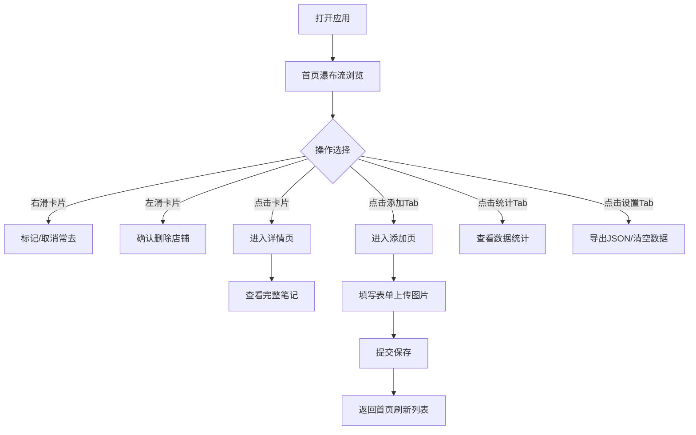

## 1. 产品概述

一款面向咖啡爱好者的个人咖啡店记录应用，帮助用户系统化记录去过的咖啡店，保留完整的探店笔记与风味体验，并通过数据统计回顾自己的咖啡足迹。

- 核心目的：解决咖啡店探店记忆零散、笔记碎片化的痛点，提供一站式记录、回顾、统计分析的体验
- 目标用户：城市咖啡爱好者、探店达人、风味记录者
- 产品价值：打造温暖治愈的个人咖啡日记，留存每一杯咖啡的美好记忆

## 2. 核心功能

### 2.1 功能模块

1. **首页**：瀑布流卡片展示、左滑删除、右滑加星标常去、点击进入详情页
2. **添加页**：表单填写 + 图片上传，完整记录探店信息
3. **统计页**：数据总览卡片 + 城市分布图表可视化
4. **详情页**：完整笔记展示、图片预览、风味描述
5. **设置页**：数据导出 JSON、应用信息展示

### 2.2 页面详情

| 页面名称 | 模块名称 | 功能描述 |
|---------|---------|---------|
| 首页 | 顶部标题栏 | 显示应用名称「咖啡足迹」、星标筛选开关 |
| 首页 | 瀑布流卡片 | 双列瀑布流布局，展示店铺封面图、店名、评分、城市、星标状态 |
| 首页 | 左滑删除操作 | 卡片左滑露出删除按钮，点击二次确认后删除 |
| 首页 | 右滑加星标操作 | 卡片右滑露出星标按钮，点击切换常去状态 |
| 首页 | 空状态提示 | 无数据时展示引导提示与快捷添加入口 |
| 添加页 | 图片上传区 | 支持本地图片上传，预览缩略图，可删除重选 |
| 添加页 | 表单输入区 | 店名（必填）、地址/城市、日期选择器、1-5星评分组件、点单内容、风味描述（多行文本） |
| 添加页 | 提交按钮 | 底部固定提交按钮，校验通过后保存并返回首页 |
| 统计页 | 数据总览卡片 | 总数、本月新增、平均评分、常去店铺数四项指标 |
| 统计页 | 城市分布图表 | 水平柱状图展示各城市探店数量排行 |
| 详情页 | 大图展示 | 顶部大图轮播/展示，可点击放大预览 |
| 详情页 | 信息展示区 | 店名、评分、日期、地址、点单内容、风味笔记完整呈现 |
| 设置页 | 导出按钮 | 一键导出所有数据为 JSON 文件下载 |
| 设置页 | 清空数据 | 二次确认后清空本地所有记录 |
| 设置页 | 应用信息 | 版本号、开发者信息展示 |
| 全局 | 底部四宫格导航 | 首页/添加/统计/设置四个 Tab 切换，高亮当前页 |

## 3. 核心流程

## 4. 用户界面设计

### 4.1 设计风格

- **主色调**：#3D2817 深咖啡色，用于标题、主要文字、导航激活态
- **背景色**：#FAF6F1 米白奶咖色，营造温暖治愈氛围
- **强调色**：#D4A574 焦糖黄，用于按钮、评分星、选中态、高亮元素
- **辅助色**：#8B6F54 浅棕灰，用于次要文字、边框分割线
- **卡片样式**：圆角 16px，微阴影（0 4px 20px rgba(61,40,23,0.08)），白色卡片底
- **按钮风格**：圆角 12px，主按钮深棕底白字，次按钮米白底深棕字边框
- **字体**：标题使用思源宋体/Noto Serif SC，正文使用思源黑体/Noto Sans SC，中文友好排版
- **图标风格**：线性描边图标，1.5px 粗度，圆润端点
- **动效**：卡片悬停微抬起，页面切换淡入过渡，操作反馈有微动效

### 4.2 页面设计总览

| 页面名称 | 模块名称 | UI 元素描述 |
|---------|---------|-------------|
| 首页 | 顶部栏 | 左对齐标题「咖啡足迹」，右侧星标筛选图标按钮，米白背景无分割线 |
| 首页 | 瀑布流卡片 | 左右两列不等高，图片比例自适应，底部叠加店名、评分、城市标签，星标角标 |
| 首页 | 滑动操作 | 左滑红底白字「删除」，右滑焦糖底白星「常去」，滑开比例 25% |
| 添加页 | 表单布局 | 顶部大图上传框，下方分组表单输入，每组卡片式包裹，标签在上输入在下 |
| 添加页 | 评分组件 | 5 颗可点击焦糖色星标，悬停半填充，点击实心填充 |
| 添加页 | 日期选择 | 点击弹出原生日历选择器，格式化为 YYYY年MM月DD日 |
| 统计页 | 数据卡片 | 2x2 网格四张卡片，上大数字米白粗体，下说明文字浅棕小字号 |
| 统计页 | 城市图表 | 左侧城市名标签，右侧横向进度条填充焦糖色，末尾显示数量 |
| 详情页 | 大图区 | 顶部 3:2 比例大图，下方渐变叠加店名和评分 |
| 详情页 | 信息列表 | 图标+标签+内容的分组列表，卡片式分区展示 |
| 设置页 | 列表项 | 带箭头的列表项，导出按钮独立深棕大按钮 |
| 全局 | 底部导航 | 固定底部，四格等宽，图标在上文字在下，激活态深棕+焦糖背景小圆点 |

### 4.3 响应式

- 移动端优先设计，适配 375px - 430px 主流手机宽度
- 桌面端居中显示，最大宽度 480px，两侧留白保持手机 App 观感
- 触摸滑动手势优化，滑动操作在触屏设备体验流畅
- 表单输入框触摸区域不小于 44px，符合移动端交互规范
