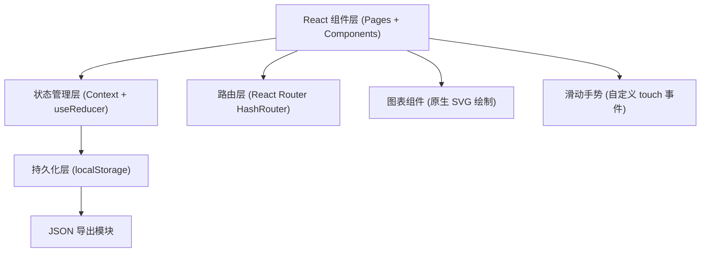
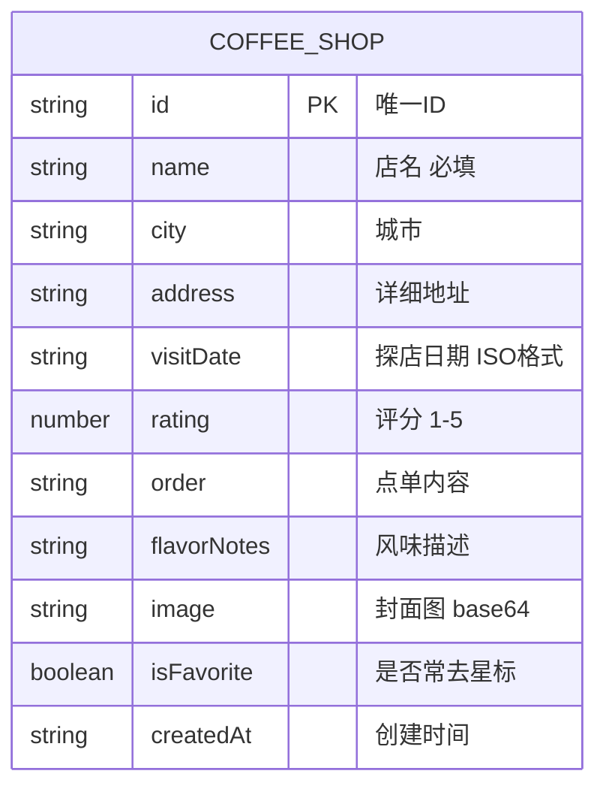

## 1. 架构设计



## 2. 技术选型说明

- **前端框架**：React@18 + TypeScript@5，组件化开发，类型安全
- **构建工具**：Vite@5，极速冷启动与 HMR，开箱即用 TS 支持
- **样式方案**：TailwindCSS@3，原子化 CSS 奶咖色主题定制
- **路由方案**：React Router@6 (HashRouter)，无需后端配置，纯静态可部署
- **状态管理**：React Context + useReducer，统一管理咖啡店数据 CRUD
- **持久化**：localStorage，纯前端无后端，数据本地存储
- **图表绘制**：原生 SVG 手写水平柱状图，零依赖轻量实现
- **滑动手势**：自定义 touchstart/touchmove/touchend 事件处理左右滑
- **图片处理**：FileReader 转 base64 存入 localStorage，无需上传服务器

## 3. 路由定义

| 路由路径 | 页面组件 | 用途说明 |
|---------|---------|---------|
| `/` | HomePage | 首页瀑布流卡片列表，左右滑操作 |
| `/add` | AddPage | 添加咖啡店记录表单页 |
| `/stats` | StatsPage | 数据统计与城市分布图表 |
| `/settings` | SettingsPage | 设置与导出 JSON |
| `/detail/:id` | DetailPage | 单店完整笔记详情页 |

## 4. 数据模型

### 4.1 数据结构定义



### 4.2 TypeScript 类型定义

```typescript
interface CoffeeShop {
  id: string;
  name: string;
  city: string;
  address: string;
  visitDate: string;
  rating: 1 | 2 | 3 | 4 | 5;
  order: string;
  flavorNotes: string;
  image: string;
  isFavorite: boolean;
  createdAt: string;
}

interface AppState {
  shops: CoffeeShop[];
  filterFavoritesOnly: boolean;
}

type AppAction =
  | { type: 'ADD_SHOP'; payload: CoffeeShop }
  | { type: 'DELETE_SHOP'; payload: string }
  | { type: 'TOGGLE_FAVORITE'; payload: string }
  | { type: 'UPDATE_SHOP'; payload: CoffeeShop }
  | { type: 'TOGGLE_FILTER' }
  | { type: 'CLEAR_ALL' }
  | { type: 'IMPORT_DATA'; payload: CoffeeShop[] };
```

### 4.3 目录结构

```
src/
├── components/           # 可复用组件
│   ├── BottomNav.tsx     # 底部四宫格导航
│   ├── CoffeeCard.tsx    # 瀑布流卡片(含滑动)
│   ├── StarRating.tsx    # 星级评分组件
│   ├── MasonryLayout.tsx # 瀑布流布局容器
│   └── StatsCard.tsx     # 统计数据卡片
├── pages/                # 页面组件
│   ├── HomePage.tsx
│   ├── AddPage.tsx
│   ├── StatsPage.tsx
│   ├── SettingsPage.tsx
│   └── DetailPage.tsx
├── context/              # 状态管理
│   └── CoffeeContext.tsx
├── utils/                # 工具函数
│   ├── storage.ts        # localStorage 封装
│   ├── export.ts         # JSON 导出
│   └── helpers.ts        # 日期/格式化辅助
├── types/                # 类型定义
│   └── index.ts
├── data/                 # Mock 初始数据
│   └── mockShops.ts
├── App.tsx
├── main.tsx
└── index.css             # Tailwind + 全局样式
```

## 5. Mock 数据预设

初始化时预置 6-8 条真实感咖啡店数据，覆盖不同城市、评分、风格，确保首屏有内容可浏览，瀑布流效果可直观感受。包含：
- 3 个不同城市（上海、北京、成都）
- 不同评分（3-5 星）
- 部分标记为常去
- 风味描述示例文本
- 使用 Unsplash 咖啡主题真实图片 URL
